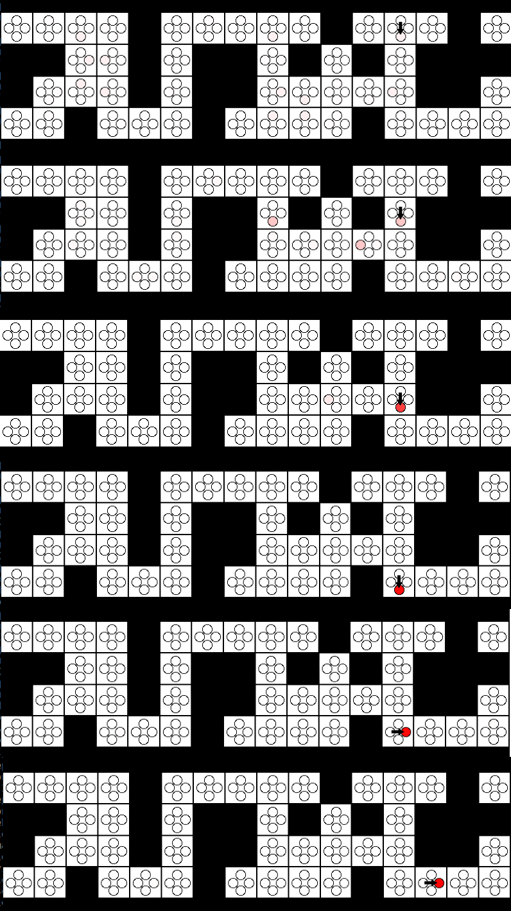
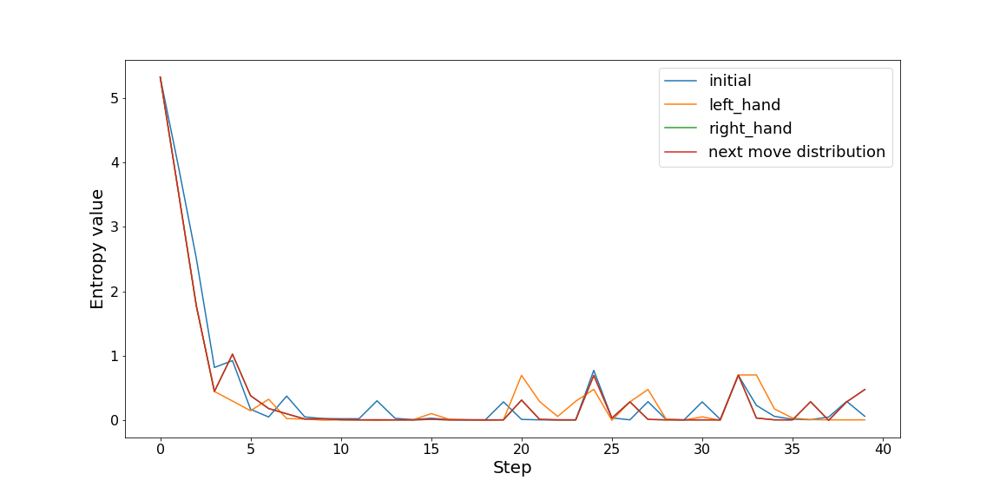

# Localization project 
Project of calculating probability distribution of robot localization having unknown robot's orientation.

1. [Robot localization](#robot-localization)
2. [Heuristics](#heuristics)

Polish language version of documentation - [README_PL.md](./README_FILES/README_PL.md)

**Environment assumptions:**
- Robot doesn't always correctly perform the maneuver of turning and driving forward. It is possible, with factor **ϵm=0.05**, that robot:
    - stay in the same place when the last action was *forward* 
    - doesn't turn if the last action was *turnleft* or *turnright*.
- Robot's sensor return list of directions relative to the robot in which obstacles have been detected e.g. ['fwd', 'right'] which means that obstacles have been detected straight ahead and to the right of the robot according to the current robot orientation. Sensors aren't perfect and can give incorrect measurement with factor **ϵs=0.1**:
  - sensor detect obstacle even though it is not there 
  - sensor doesn't detect obstacle even though it is there 
- Value *bump* in percept list of sensor can improve accuracy of localization.

**Tasks**
- Implement functions to calculate probability distribution of robot localization.
- Modification of robot motion heuristics to accelerate algorithm convergence. Robot should choose actions which give him most information.

## Robot localization

## Heuristics
To choose next robot's move was tested several heuristics:
- initial - base on random choice of possible next action
- right hand - base on moving forward and turn right if moving forward is impossible
- left hand - base on moving forward and turn left if moving forward is impossible
- next move distribution - base on calculating distribution of next movement using movement factor with current percept and choosing the best and possible action

For each heuristics' step was calculated value of entropy what is show in grouped plot below.

Both right hand and next move distribution heuristics gives the same results for first 40 samples and are better than initial heuristics. Next move distribution heuristics let to choose movement which can maximize robot percepts and minimalize entropy of robot localization probability distribution.