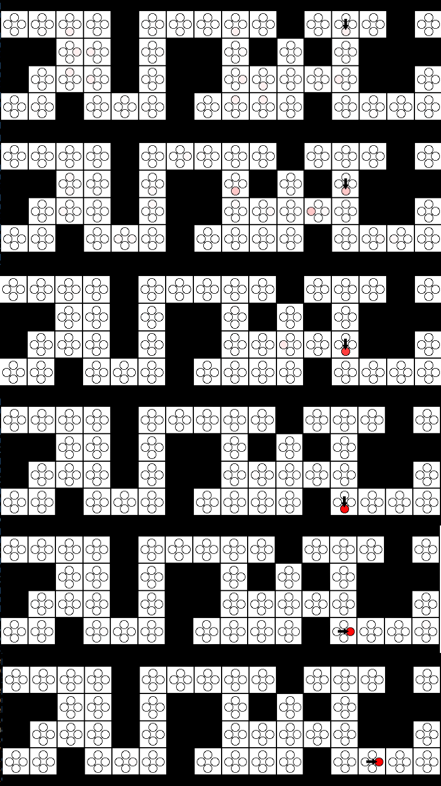
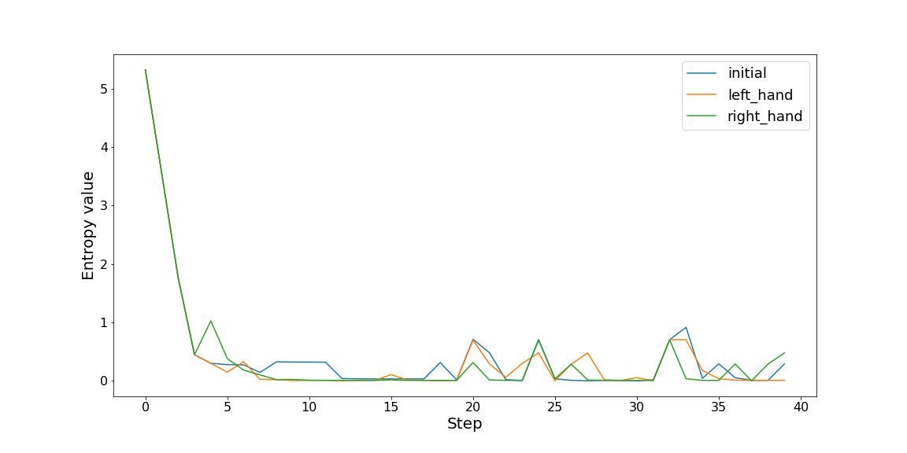

# Localization project 
Projekt bazuje na obliczeniu rozkładu prawdopodobieństwa lokalizacji robota uwzględniając nieznaną orientację robota.

1. [Lokalizacja robota](#lokalizacja-robota)
2. [Heurystyki](#heurystyki)

**Założenia rozpatrywanego świata:**
- Robot nie zawsze poprawnie wykonuje manewr obracania i jazdy do przodu. Istnieje szansa **ϵm=0.05**, że robot pozostanie w tym samym miejscu w przypadku, gdy ostatnią komendą było *forward* lub się nie obróci w przypadku, gdy ostatnią komendą było *turnleft* lub *turnright*.
- Czujniki robota zwracają listę kierunków względem robota, w których zostały wykryte przeszkody, np. ['fwd', 'right'] oznacza, że przeszkody zostały wykryte na wprost i na prawo od robota (patrząc w aktualnym kierunku robota). Niestety, czujniki te nie są perfekcyjne i czasami zwracają błędne pomiary. Istnieje szansa **ϵs=0.1**, że sensor zwróci błędny pomiar, tzn. wykryje obecność przeszkody, jeśli jej tam nie ma lub nie wykryje przeszkody mimo jej obecności.
- Możesz także wykorzystać wartość bump otrzymaną w zmiennej percept, żeby poprawić dokładność lokalizacji.

**Zadania:**
- Napisanie kodu odpowiedzialnego za obliczanie rozkładu lokalizacji robota.
- Modyfikacja heurystyki poruszającej robotem, aby jak najbardziej przyspieszyć zbieżność algorytmu. Robot powinien wybierać takie akcje, które dostarczą mu jak najwięcej informacji.

## Lokalizacja robota

## Heurystyki
Do wybrania następnego ruchu robota zostały przetestowane następujące heurystyki:
- początkowa - bazuje na losowym wyborze możliwego ruchu
- prawej dłoni - bazuje na ruchu na wprost i obrocie w prawo jeśli nie jest on dostępny
- lewej dłoni - bazuje na ruchu na wprost i obrocie w lewo jeśli nie jest on dostępny
- dystrybucja następnego ruchu - bazuje na obliczeniu rozkładu dystrybucji następnych ruchów przy wykorzystaniu czynnika ruchu z wykorzystaniem aktualnej wrtości *percept* z sensora i wybraniu najlepszej możliwej akcji

Dla każdej heurystyki i dla każdego ruchu wyliczona została wartość entropii. Zbiorczy wykres wartości entropii dla każdej z heurystyk został przedstawiony poniżej.

Zarówno heurystyka prawej dłoni, jak i dystrybucji następnego ruchu dają takie same rezultaty dla pierwszych 40 próbek i są one lepsze niż przy wykorzystaniu początkowej heurystyki. Heurystyka dystrybucji następnego ruchu pozwala na wybór akcji, która maksymalizuje percepcje robota i minimalizuje entopii rozkładu dystrybucji prawdopodobieństwa lokalizacji robota.